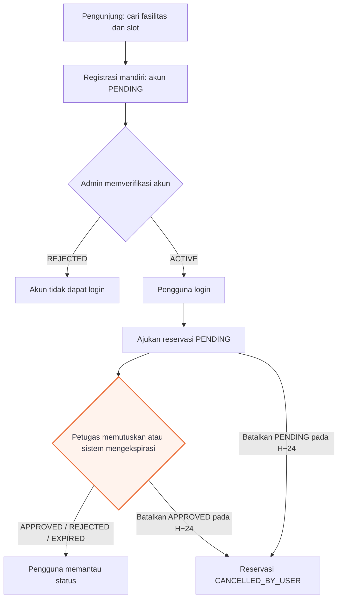
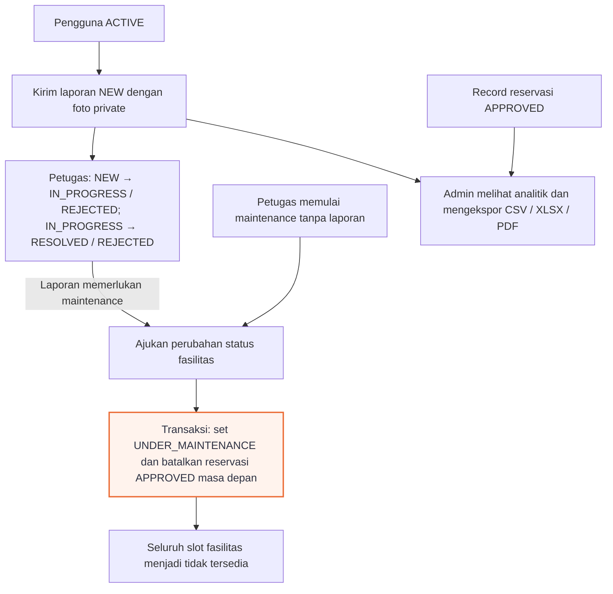

# Product Requirements Document — Ruvana

| Metadata | Nilai |
|---|---|
| Status | Disetujui untuk perencanaan implementasi |
| Tanggal | 9 September 2026 |
| Target rilis | Sebelum tenggat UTS, 11 Oktober 2026 pukul 12.00 WIB |
| Sumber awal | Arsip lokal `docs/Project PPK 2026.md` (tidak dilacak Git), `TASK.md`, fondasi kode Ruvana, dan keputusan desain tim |

> [!IMPORTANT]
> PRD ini adalah sumber kebenaran untuk scope, perilaku produk, aturan bisnis, dan kriteria penerimaan Ruvana. Jika ketentuan lama bertentangan dengan keputusan pada Bagian 20, PRD ini yang berlaku.

## Daftar Isi

- [Cara Membaca Dokumen](#cara-membaca-dokumen)
1. [Ringkasan Eksekutif](#1-ringkasan-eksekutif)
2. [Latar Belakang dan Masalah](#2-latar-belakang-dan-masalah)
3. [Tujuan dan Indikator Keberhasilan](#3-tujuan-dan-indikator-keberhasilan)
4. [Non-goals Rilis UTS](#4-non-goals-rilis-uts)
5. [Aktor dan Hak Akses](#5-aktor-dan-hak-akses)
6. [Perjalanan Pengguna Utama](#6-perjalanan-pengguna-utama)
   - [6.1 Diagram workflow sistem](#61-diagram-workflow-sistem)
   - [6.2 Urutan ringkas](#62-urutan-ringkas)
7. [Stack dan Arsitektur](#7-stack-dan-arsitektur)
8. [Aturan Bisnis Global](#8-aturan-bisnis-global)
9. [Requirement Fungsional](#9-requirement-fungsional)
10. [Model Data Konseptual](#10-model-data-konseptual)
11. [Validasi, Keamanan, dan Error Handling](#11-validasi-keamanan-dan-error-handling)
12. [Aksesibilitas dan Usability](#12-aksesibilitas-dan-usability)
13. [Deployment dan Batas Layanan](#13-deployment-dan-batas-layanan)
14. [Strategi Pengujian](#14-strategi-pengujian)
15. [Ownership Tim](#15-ownership-tim)
16. [Urutan Milestone](#16-urutan-milestone)
17. [Risiko dan Mitigasi](#17-risiko-dan-mitigasi)
18. [Traceability 17 User Story](#18-traceability-17-user-story)
19. [Definition of Done Rilis UTS](#19-definition-of-done-rilis-uts)
20. [Keputusan Final dan Resolusi Konflik](#20-keputusan-final-dan-resolusi-konflik)

## Cara Membaca Dokumen

### Konvensi

- ID requirement seperti `IAM-01`, `FAC-02`, dan `RES-06` bersifat stabil dan digunakan oleh OpenAPI, test, issue, serta pull request. Acceptance criteria dirujuk menggunakan ID requirement dan isi kriterianya, bukan nomor urut bullet.
- Setiap butir pada **Acceptance criteria** adalah syarat wajib rilis, kecuali dinyatakan sebagai non-goal.
- Nilai status dalam `UPPER_SNAKE_CASE` adalah nilai teknis yang harus digunakan secara konsisten.
- Kata **harus** menunjukkan kewajiban; **dapat** menunjukkan kemampuan yang tersedia, bukan requirement opsional.
- Detail implementasi hanya normatif jika dinyatakan sebagai constraint atau dirujuk oleh acceptance criteria.

### Batas sumber kebenaran

| Artefak | Menjadi sumber kebenaran untuk |
|---|---|
| `docs/PRD.md` | Scope, perilaku, aturan bisnis, dan acceptance criteria |
| `docs/DESIGN.md` | Visual, layout, komponen, dan interaksi UI |
| `docs/superpowers/DECISION.md` | Keputusan arsitektur lintas modul dan konsekuensinya |
| `docs/api/openapi.yaml` | Kontrak HTTP antara frontend dan backend |
| `prisma/schema.prisma` | Bentuk schema database yang telah diimplementasikan |
| `README.md` | Setup, operasi lokal, akun demo, dan deployment |

Perubahan yang menyentuh lebih dari satu batas harus memperbarui seluruh artefak terdampak dalam pull request yang sama. Dokumen turunan tidak boleh melemahkan aturan bisnis PRD.

## 1. Ringkasan Eksekutif

Ruvana adalah aplikasi web reservasi dan pelaporan fasilitas kampus. Aplikasi menyediakan informasi fasilitas dan ketersediaannya kepada publik, memungkinkan pengguna terverifikasi mengajukan reservasi dan laporan kerusakan, membantu petugas memproses antrean operasional, serta memberi admin sarana mengelola akun, fasilitas, dan rekap penggunaan.

Rilis UTS mencakup seluruh 17 user story pada dokumen proyek. Produk harus dapat dijalankan secara lokal dan melalui deployment Vercel. Batas sumber kebenaran setiap artefak dijelaskan pada bagian Cara Membaca Dokumen.

## 2. Latar Belakang dan Masalah

Pengelolaan fasilitas tanpa sistem terpusat menimbulkan tiga masalah utama:

1. calon pengguna sulit mengetahui fasilitas dan slot yang benar-benar tersedia;
2. proses persetujuan manual berisiko menghasilkan jadwal yang bertabrakan; dan
3. laporan kerusakan, status maintenance, serta dampaknya terhadap reservasi sulit ditelusuri.

Ruvana menyatukan discovery, reservasi, pelaporan, maintenance, dan rekap dalam satu alur dengan aturan yang konsisten.

## 3. Tujuan dan Indikator Keberhasilan

### 3.1 Tujuan

- Menyediakan daftar fasilitas dan ketersediaan per slot kepada publik.
- Memastikan tidak ada dua reservasi berstatus `APPROVED` yang tumpang tindih.
- Menyediakan alur reservasi dan pelaporan yang dapat ditelusuri oleh pemiliknya.
- Menghubungkan status maintenance dengan ketersediaan dan reservasi secara konsisten.
- Menyediakan rekap okupansi dan kerusakan yang dapat diekspor.
- Memenuhi ketentuan arsitektur, validasi, dokumentasi, dan kontribusi tim pada tugas UTS.

### 3.2 Indikator keberhasilan rilis

- Seluruh 17 user story lulus User Acceptance Test (UAT).
- Semua pemeriksaan role dan ownership lulus pengujian negatif.
- Pengujian konkurensi membuktikan paling banyak satu reservasi bertabrakan yang dapat disetujui.
- Dataset pada dashboard, CSV, XLSX, dan PDF konsisten untuk filter yang sama.
- Alur utama lulus smoke test di lingkungan lokal dan Vercel.
- Instalasi baru dapat menjalankan migration dan seed secara berulang.
- Setiap anggota memiliki kontribusi repository yang dapat ditelusuri.

## 4. Non-goals Rilis UTS

Rilis ini tidak mencakup:

- aplikasi mobile native;
- pembayaran;
- reservasi berulang;
- integrasi kalender eksternal;
- notifikasi email, WhatsApp, atau push;
- Single Sign-On kampus;
- multi-kampus atau multi-tenant;
- inventaris suku cadang dan biaya maintenance; serta
- analitik prediktif.

## 5. Aktor dan Hak Akses

### 5.1 Pengunjung

Tidak memerlukan login. Dapat melihat, mencari, dan memfilter fasilitas serta melihat ketersediaan slot tanpa identitas pemesan.

### 5.2 Pengguna

Merupakan akun `ACTIVE` dengan role `pengguna`. Dapat membuat dan melihat reservasi miliknya, membatalkan reservasi sesuai batas waktu, membuat laporan kerusakan, dan memantau laporan miliknya.

### 5.3 Petugas

Merupakan akun `ACTIVE` dengan role `petugas`. Dapat memproses reservasi dan laporan, membatalkan reservasi secara mendesak, serta mengubah status maintenance fasilitas. Petugas tidak dapat mendaftar mandiri.

### 5.4 Admin

Merupakan akun `ACTIVE` dengan role `admin`. Dapat mengelola akun dan fasilitas, memverifikasi pendaftaran mandiri, serta melihat dan mengekspor analitik.

## 6. Perjalanan Pengguna Utama

### 6.1 Diagram workflow sistem

Workflow dibagi menjadi dua diagram agar setiap alur tetap terbaca. Detail validasi, otorisasi, dan transisi status tetap mengikuti requirement terkait.

#### Akun dan reservasi



#### Pelaporan, maintenance, dan analitik

Jalur laporan berdiri sendiri dan tidak mensyaratkan pengguna pernah membuat reservasi. Petugas juga dapat memulai maintenance tanpa menunggu laporan kerusakan.



Operasi maintenance pada node beraksen wajib bersifat all-or-nothing sesuai `RES-09`: perubahan status fasilitas dan pembatalan reservasi terkait menggunakan satu transaksi PostgreSQL. Analitik kerusakan menghitung laporan sejak dibuat, tanpa menunggu laporan selesai diproses.

### 6.2 Urutan ringkas

1. Pengunjung mencari fasilitas dan memeriksa slot yang tersedia.
2. Pengunjung mendaftar; akun tersimpan sebagai `PENDING`.
3. Admin memverifikasi akun sehingga status menjadi `ACTIVE`.
4. Pengguna login, memilih slot berurutan, dan mengajukan reservasi `PENDING`.
5. Petugas meninjau antrean dan menyetujui atau menolak reservasi.
6. Pengguna melihat status reservasi atau membatalkannya paling lambat 24 jam sebelum mulai.
7. Pengguna mengunggah foto dan mengirim laporan kerusakan.
8. Petugas memproses laporan dan, bila perlu, mengubah fasilitas menjadi `UNDER_MAINTENANCE`.
9. Sistem memblokir fasilitas dan membatalkan reservasi masa depan yang telah disetujui.
10. Admin memantau rekap okupansi dan kerusakan serta mengekspor hasilnya.

## 7. Stack dan Arsitektur

### 7.1 Stack yang disetujui

- Next.js 16 App Router
- React 19
- TypeScript 5
- Tailwind CSS v4
- Prisma 7 dengan adapter PostgreSQL
- PostgreSQL 16
- pnpm 10
- Vercel untuk hosting
- Prisma Postgres untuk database production
- Vercel Blob private storage untuk foto laporan

### 7.2 Pemisahan M/C/V

- **Model:** `prisma/schema.prisma`, migrations, seed, generated Prisma Client, dan `lib/prisma.ts`.
- **Controller:** route handler HTTP di bawah `app/api/` dan service bisnis di `lib/`. Server Action, jika digunakan untuk kebutuhan server-only, hanya menjadi adapter tipis ke service dan bukan kontrak frontend–backend.
- **View:** page/layout App Router dan komponen di `components/`.
- **Config:** nilai bisnis terpusat di `config/`.

View tidak boleh menjalankan query Prisma atau memiliki aturan bisnis. Folder `/views` literal tidak dibuat karena View direpresentasikan oleh konvensi Next.js App Router. Keputusan ini mempertahankan pemisahan tanggung jawab yang diminta dokumen proyek tanpa melawan struktur framework.

### 7.3 Prinsip integrasi

- Akses database biasa dimulai melalui singleton Prisma. Operasi di dalam transaksi wajib menggunakan `Prisma.TransactionClient` yang diberikan pemilik transaksi dan tidak kembali memakai singleton sampai transaksi selesai.
- Semua mutasi penting memeriksa autentikasi, role, ownership, dan input di server.
- Nilai bisnis tidak di-hardcode pada UI atau service yang tersebar.
- Perubahan status fasilitas berkomunikasi dengan modul reservasi melalui kontrak `facility.status.changed`.
  - Event berjalan di dalam transaksi PostgreSQL yang sama, bukan asynchronous setelah commit.
  - Signature target listener adalah `(transaction: Prisma.TransactionClient, payload: FacilityStatusChangedPayload) => Promise<void>`.
  - Service perubahan status memiliki transaksi; emitter meneruskan client transaksi dan menunggu listener.
  - Listener tidak boleh membuka transaksi baru atau memakai singleton Prisma untuk operasi dalam event.
- Foto disimpan sebagai objek private; PostgreSQL hanya menyimpan URL/pathname dan metadata minimum (MIME type serta ukuran byte), tidak pernah binary file.

### 7.4 Kontrak dan dokumentasi pendamping

- `docs/api/openapi.yaml` menggunakan OpenAPI 3.1.2 dalam format YAML dan menjadi kontrak seluruh route handler HTTP yang digunakan frontend.
- Kode frontend yang berjalan di browser memanggil route handler sesuai kontrak OpenAPI. Route handler menangani batas HTTP, lalu mendelegasikan aturan bisnis dan akses data kepada service di `lib/`.
- Server Component boleh memanggil service read-only yang sama secara langsung dan tidak melakukan HTTP request ke route handler milik aplikasi sendiri. Bentuk data yang tampil tetap mengikuti istilah domain dan aturan akses yang sama.
- `docs/superpowers/DECISION.md` mencatat keputusan teknis lintas modul yang tidak dapat diwakili oleh PRD, OpenAPI, atau Prisma schema. Dokumen dibuat ketika keputusan pertama perlu dicatat dan tidak menduplikasi isi dokumen lain.
- `DESIGN.md` dari repository prototipe menjadi sumber kebenaran visual setelah disalin ke `docs/DESIGN.md`. Header snapshot wajib mencatat URL repository sumber dan commit hash agar versi desain dapat ditelusuri.
- `README.md` tetap menjadi panduan setup dan operasi lokal. Checklist UAT dibuat terpisah menjelang rilis, bukan pada fase desain awal.

**Acceptance criteria dokumentasi:**

- OpenAPI lolos parser/linter yang mendukung OpenAPI 3.1.2.
- Setiap route handler yang dipanggil frontend tercantum beserta autentikasi, parameter, request, success response, dan bentuk error-nya.
- Perubahan kontrak HTTP dan OpenAPI diperbarui dalam perubahan repository yang sama.
- `docs/superpowers/DECISION.md` hanya memuat keputusan yang telah disetujui, alasan, konsekuensi, dan tanggal keputusan; tidak menjadi salinan PRD.
- Review visual dan penerimaan UI tidak dapat diselesaikan sebelum snapshot `docs/DESIGN.md` mempunyai sumber dan commit hash yang dapat diverifikasi.
- README dinyatakan lengkap jika memuat prasyarat, environment variable tanpa secret, instalasi dependency, Prisma generate, migration, seed, cara menjalankan lokal, akun demo, pemeriksaan CI, dan ringkasan deployment production.

## 8. Aturan Bisnis Global

- Jam operasional adalah 07.00–20.00.
- Satu slot berdurasi 30 menit; tersedia 26 slot per hari.
- Waktu mulai dan selesai harus tepat pada batas slot.
- Waktu selesai harus sesudah waktu mulai dan tidak melewati pukul 20.00.
- Reservasi tidak dapat dibuat untuk tanggal lampau maupun slot hari ini yang instant mulainya sudah sama dengan atau lebih awal dari waktu server saat pengajuan.
- Reservasi `PENDING` boleh saling overlap.
- Hanya reservasi `APPROVED` yang memblokir ketersediaan.
- Persetujuan selalu melakukan pemeriksaan konflik terakhir secara atomik.
- Pengguna dapat membatalkan reservasi miliknya jika waktu mulai masih sekurang-kurangnya 24 jam lagi.
- Fasilitas `UNDER_MAINTENANCE` atau `INACTIVE` tidak dapat direservasi.
- Perubahan ke `UNDER_MAINTENANCE` membatalkan seluruh reservasi masa depan berstatus `APPROVED`.
- Tanggal pilihan pengguna dimaknai sebagai tanggal kalender `Asia/Jakarta` dan disimpan sebagai PostgreSQL `DATE`.
- Waktu mulai/selesai merupakan instant absolut, disimpan sebagai `TIMESTAMPTZ` dalam UTC, lalu ditampilkan dalam `Asia/Jakarta`.
- Batas H−24 dihitung sebagai selisih tepat 24 jam antara instant saat aksi diproses dan instant waktu mulai.
- Filter tanggal analitik bersifat inklusif menurut kalender `Asia/Jakarta`; server mengubahnya menjadi rentang UTC setengah-terbuka dari pukul 00.00 pada tanggal awal sampai pukul 00.00 sehari setelah tanggal akhir.

## 9. Requirement Fungsional

### 9.1 Modul Identity & Account

#### IAM-01 — Registrasi mandiri

Pengunjung dapat mendaftar sebagai pengguna dengan identitas, email unik, dan password.

**Acceptance criteria:**

- Form melakukan validasi client dan server.
- Email dinormalisasi dan tidak dapat digunakan oleh lebih dari satu akun.
- Password disimpan sebagai hash.
- Akun baru ber-role `pengguna` dan berstatus `PENDING`.
- Akun `PENDING` belum dapat login.

#### IAM-02 — Login dan logout

Pemilik akun `ACTIVE` dapat memulai dan mengakhiri sesi.

**Acceptance criteria:**

- Kredensial valid untuk akun aktif menghasilkan sesi aman.
- Kegagalan login menggunakan pesan generik yang tidak membocorkan keberadaan atau status akun.
- Logout mengakhiri sesi sehingga kredensial sesi lama tidak dapat digunakan kembali.
- Cookie sesi bersifat `HttpOnly`, `SameSite`, dan `Secure` pada production.

#### IAM-03 — Otorisasi dan ownership

Semua halaman dan mutasi terlindungi memeriksa sesi serta role di server.

**Acceptance criteria:**

- Pengguna tidak dapat membaca atau mengubah reservasi/laporan milik pengguna lain.
- Petugas dan admin hanya dapat menjalankan aksi sesuai role.
- Akses tanpa autentikasi dan akses tanpa izin menghasilkan respons berbeda tanpa membocorkan data.

#### IAM-04 — Pembuatan akun petugas

Admin dapat membuat akun petugas yang langsung aktif. Petugas tidak memiliki jalur registrasi mandiri.

**Acceptance criteria:**

- Hanya admin aktif yang dapat membuat akun petugas.
- Input yang tidak valid atau email yang telah digunakan ditolak tanpa membuat akun parsial.
- Akun berhasil dibuat dengan role `petugas`, status `ACTIVE`, dan password yang telah di-hash.
- Akun baru tampil pada pengelolaan akun dan dapat login menggunakan kredensial yang benar.

#### IAM-05 — Pembuatan akun pengguna langsung

Admin dapat membuat akun pengguna yang langsung aktif tanpa menunggu verifikasi.

**Acceptance criteria:**

- Hanya admin aktif yang dapat menggunakan alur ini.
- Input yang tidak valid atau email yang telah digunakan ditolak tanpa membuat akun parsial.
- Akun berhasil dibuat dengan role `pengguna`, status `ACTIVE`, dan pembuat akun tercatat.
- Akun dapat langsung login tanpa melalui antrean verifikasi.

#### IAM-06 — Verifikasi pendaftaran

Admin dapat menyetujui atau menolak akun `PENDING`.

**Acceptance criteria:**

- Persetujuan mengubah status menjadi `ACTIVE` dan mencatat waktu verifikasi.
- Penolakan mengubah status menjadi `REJECTED`.
- Aksi terhadap akun yang sudah diproses ditolak secara aman.

#### IAM-07 — Pengelolaan akun

Admin dapat mencari dan memfilter akun serta menonaktifkan atau mengaktifkan kembali akun.

**Acceptance criteria:**

- Admin dapat mencari akun berdasarkan identitas atau email dan memfilter role serta status.
- Hasil tidak pernah memuat password hash atau kredensial sesi.
- Akun `DISABLED` tidak dapat membuat sesi baru atau melanjutkan operasi terlindungi.
- Aktivasi kembali hanya mengubah akun `DISABLED` menjadi `ACTIVE` dan tidak mengubah role atau histori akun.

**Transisi status akun:**

- `PENDING → ACTIVE | REJECTED`
- `ACTIVE ↔ DISABLED`

### 9.2 Modul Facility & Discovery

#### FAC-01 — Daftar dan detail fasilitas publik

Pengunjung dapat melihat nama, tipe, lokasi, kapasitas, deskripsi, dan status fasilitas tanpa login.

**Acceptance criteria:**

- Daftar dan detail dapat dibaca tanpa sesi pengguna.
- Kueri publik hanya menampilkan fasilitas `ACTIVE` dan `UNDER_MAINTENANCE`; fasilitas `INACTIVE` tidak muncul pada daftar.
- Setiap item menampilkan field publik yang sama dan tidak memuat data reservasi pribadi.
- Detail fasilitas yang tidak ditemukan atau berstatus `INACTIVE` menghasilkan keadaan `not found` yang aman.
- Status fasilitas yang tampil berasal dari data terbaru, bukan nilai yang di-hardcode pada View.

#### FAC-02 — Ketersediaan per slot

Detail fasilitas menampilkan 26 slot untuk tanggal yang dipilih.

**Acceptance criteria:**

- Slot dengan reservasi `APPROVED` ditampilkan tidak tersedia.
- Reservasi `PENDING` tidak menutup slot.
- Semua slot tetap terlihat tetapi tidak tersedia ketika fasilitas `UNDER_MAINTENANCE`.
- Permintaan detail atau ketersediaan publik untuk fasilitas `INACTIVE` menghasilkan keadaan `not found` yang sama seperti identifier yang tidak ada, tanpa mengungkap data fasilitas.
- Identitas dan tujuan pemesan tidak tampil kepada publik.

#### FAC-03 — Pencarian dan filter

Pengunjung dapat mencari berdasarkan kata kunci dan memfilter berdasarkan tipe, lokasi, serta kapasitas minimum. Filter yang aktif digabungkan dengan logika AND.

**Acceptance criteria:**

- Kata kunci dan filter dapat digunakan sendiri-sendiri maupun bersamaan.
- Hanya fasilitas yang memenuhi seluruh filter aktif yang dikembalikan.
- Kapasitas minimum harus berupa bilangan positif yang valid.
- Kombinasi tanpa hasil menampilkan keadaan kosong, bukan error.

#### FAC-04 — Sinkronisasi status publik

Perubahan status fasilitas harus tercermin secara konsisten pada daftar, detail, dan grid ketersediaan tanpa menduplikasi aturan di View.

- Mutasi yang berhasil menginvalidasi data terkait sebelum merespons.
- UI yang melakukan mutasi melakukan refetch.
- Klien lain memperoleh status terbaru pada navigasi atau refetch berikutnya.
- Pembaruan realtime tanpa refetch berada di luar scope.

**Acceptance criteria:**

- Setelah mutasi status berhasil dan data di-refetch, fasilitas yang masih terlihat publik menghasilkan status yang sama pada daftar, detail, dan grid ketersediaan.
- `UNDER_MAINTENANCE` tetap terlihat publik dengan seluruh slot tidak dapat dipilih.
- Setelah fasilitas menjadi `INACTIVE`, fasilitas hilang dari daftar dan detail maupun ketersediaan publik menghasilkan keadaan `not found` yang sama seperti identifier yang tidak ada.
- Pengembalian ke `ACTIVE` menghitung ulang ketersediaan dari reservasi `APPROVED`, bukan membuka semua slot secara buta.

#### FAC-05 — Pengelolaan fasilitas

Admin dapat membuat, membaca, memperbarui, dan menonaktifkan fasilitas.

**Acceptance criteria:**

- Nama fasilitas unik.
- Kapasitas berupa bilangan positif.
- Fasilitas yang memiliki histori tidak dihapus secara fisik; gunakan status `INACTIVE`.

### 9.3 Modul Reservation

#### RES-01 — Pengajuan reservasi

Pengguna memilih satu atau beberapa slot berurutan pada satu fasilitas dan tanggal, mengisi tujuan, lalu mengajukan reservasi berstatus `PENDING`.

**Acceptance criteria:**

- Hanya pengguna `ACTIVE` yang dapat mengajukan reservasi.
- Slot yang dipilih harus berurutan, berada pada satu fasilitas dan tanggal, serta memiliki waktu selesai setelah waktu mulai.
- Tujuan wajib diisi sesuai batas input yang ditetapkan.
- Pengajuan valid membuat tepat satu reservasi `PENDING` milik pengguna yang sedang login.
- Waktu pengajuan dicatat oleh server saat reservasi berhasil dibuat dan tidak dapat ditentukan oleh klien.

#### RES-02 — Validasi reservasi

Server menolak pengajuan dengan kondisi berikut:

- tanggal lampau;
- slot hari ini yang sudah mulai atau berlalu;
- waktu di luar jam operasional atau tidak selaras slot;
- rentang kosong atau terbalik;
- fasilitas tidak tersedia; atau
- bentrok dengan reservasi `APPROVED`.

Perbandingan slot hari ini menggunakan instant UTC hasil konversi tanggal/waktu `Asia/Jakarta`. Slot dengan waktu mulai tepat sama dengan waktu server ditolak, bukan dibuat lalu diubah menjadi `EXPIRED`.

**Acceptance criteria:**

- Seluruh aturan tetap ditegakkan ketika request dikirim tanpa melalui validasi frontend.
- Kegagalan mengembalikan error yang dapat dikaitkan dengan field atau aturan penyebab tanpa membuat reservasi parsial.
- Reservasi `PENDING` lain tidak dianggap konflik, sedangkan setiap irisan dengan `APPROVED` dianggap konflik.
- Kasus batas waktu tepat pada jam buka, jam tutup, waktu sekarang, dan pergantian tanggal `Asia/Jakarta` tercakup pengujian.

#### RES-03 — Riwayat dan detail

Pengguna dapat melihat status dan detail seluruh reservasi miliknya, termasuk alasan penolakan atau pembatalan.

**Acceptance criteria:**

- Daftar memuat seluruh status reservasi milik pengguna dan dapat dibuka ke detail.
- Detail menampilkan fasilitas, tanggal, waktu, tujuan, status, dan alasan yang tersedia.
- Pengguna tidak dapat membaca reservasi milik pengguna lain dengan mengganti identifier.
- Keadaan tanpa riwayat ditampilkan sebagai keadaan kosong, bukan error.

#### RES-04 — Pembatalan oleh pengguna

Pengguna dapat membatalkan reservasi `PENDING` atau `APPROVED` miliknya dengan alasan jika waktu mulai masih sekurang-kurangnya 24 jam lagi.

**Acceptance criteria:**

- Pembatalan tepat pada H−24 diterima; pembatalan setelah batas tersebut ditolak.
- Alasan wajib diisi dan disimpan pada reservasi.
- Hanya pemilik reservasi dengan status yang diizinkan yang dapat membatalkan.
- Pembatalan berulang tidak mengubah status terminal atau menggandakan efek samping.

#### RES-05 — Antrean petugas

Petugas dapat melihat reservasi `PENDING` yang belum kedaluwarsa dan memprosesnya.

**Acceptance criteria:**

- Antrean hanya dapat diakses petugas atau admin yang berwenang.
- Setelah proses expiry, antrean diurutkan stabil secara FIFO berdasarkan waktu pengajuan dari server secara menaik, lalu identifier reservasi secara menaik sebagai tie-breaker.
- Reservasi yang telah diproses atau kedaluwarsa tidak tampil sebagai item aktif.
- Setiap item menyediakan informasi fasilitas, pemohon, tanggal/waktu, dan tujuan yang diperlukan untuk mengambil keputusan.
- Data antrean dibaca setelah proses expiry idempoten dijalankan.

#### RES-06 — Persetujuan dan penolakan

**Acceptance criteria:**

- Approval melakukan pemeriksaan konflik ulang dalam operasi atomik.
- Jika konflik muncul, approval gagal dan data slot terbaru dikembalikan.
- Rejection wajib memiliki alasan.
- Hanya reservasi `PENDING` yang belum kedaluwarsa yang dapat diputuskan.
- Operasi berhasil mencatat petugas dan waktu pemrosesan tepat satu kali.

#### RES-07 — Pembatalan mendesak

Petugas dapat membatalkan reservasi `APPROVED` dengan alasan wajib.

**Acceptance criteria:**

- Hanya petugas atau admin yang berwenang yang dapat menjalankan aksi.
- Hanya reservasi `APPROVED` yang dapat berubah menjadi `CANCELLED_BY_OFFICER`.
- Alasan, pelaku, dan waktu pembatalan dicatat serta terlihat oleh pemilik reservasi.

#### RES-08 — Kedaluwarsa

Reservasi `PENDING` yang waktu mulainya telah lewat menjadi `EXPIRED` dan tidak tampil dalam antrean aktif. Proses kedaluwarsa bersifat idempoten dan dijalankan sebelum pembacaan antrean serta saat operasi reservasi terkait.

**Acceptance criteria:**

- Hanya reservasi `PENDING` dengan waktu mulai yang telah lewat yang diubah.
- Menjalankan proses berulang menghasilkan keadaan akhir yang sama tanpa efek samping tambahan.
- Reservasi yang kedaluwarsa tetap tersedia pada riwayat pemiliknya.

#### RES-09 — Dampak maintenance

Saat fasilitas berubah menjadi `UNDER_MAINTENANCE`, semua reservasi masa depan berstatus `APPROVED` berubah menjadi `CANCELLED_BY_OFFICER` dengan alasan otomatis yang dapat dilihat pengguna.

**Acceptance criteria:**

- Service perubahan status membuka satu transaksi PostgreSQL.
- Service meneruskan `Prisma.TransactionClient` yang sama kepada listener `facility.status.changed` dan menunggu listener sebelum commit.
- Respons berhasil hanya diberikan setelah perubahan status dan seluruh pembatalan wajib tersimpan.
- Kegagalan salah satu operasi me-roll back seluruh perubahan.
- Kontrak listener fase awal diubah ke signature pada Bagian 7.3 dan keputusan dicatat pada `docs/superpowers/DECISION.md` sebelum implementasi.
- Hanya reservasi `APPROVED` dengan waktu mulai setelah instant perubahan status yang dibatalkan.
- Reservasi fasilitas lain dan histori masa lalu tidak berubah.
- Pemicu yang diproses ulang tidak menggandakan pembatalan atau alasan.

**Transisi status reservasi:**

- `PENDING → APPROVED | REJECTED | EXPIRED | CANCELLED_BY_USER`
- `APPROVED → CANCELLED_BY_USER | CANCELLED_BY_OFFICER`
- Status terminal tidak dapat dibuka kembali.

### 9.4 Modul Reporting & Maintenance

#### REP-01 — Pembuatan laporan kerusakan

Pengguna membuat laporan untuk satu fasilitas dengan kategori, deskripsi, dan satu foto wajib.

Kategori awal: Listrik, Peralatan, Furnitur, Bangunan, Kebersihan, dan Lainnya.

**Acceptance criteria:**

- Fasilitas, kategori, deskripsi, dan satu foto wajib lolos validasi sebelum laporan dibuat.
- UI menyampaikan format JPEG/PNG/WebP dan batas 5 MB sebelum pengguna memilih file.
- Frontend menggunakan pembatas file picker dan memvalidasi tipe serta ukuran untuk umpan balik cepat.
- Backend mengautentikasi pengguna dan memvalidasi metadata sebelum menerbitkan presigned upload URL.
- Presigned URL membatasi pathname acak, operasi, masa berlaku, tipe konten, dan ukuran maksimal 5 MB.
- Vercel Blob menegakkan `allowedContentTypes` dan `maximumSizeInBytes` walaupun validasi frontend dilewati.
- Backend memverifikasi ukuran, MIME type, dan signature bytes hasil upload sebelum menyimpan referensi foto dan membuat laporan.
- Blob yang tidak valid atau gagal dikaitkan ke laporan dibersihkan.
- Laporan berhasil dibuat dengan status `NEW` hanya setelah upload tervalidasi.

#### REP-02 — Riwayat laporan

Pengguna dapat melihat daftar, detail, status terkini, dan catatan penyelesaian laporan miliknya.

**Acceptance criteria:**

- Daftar memuat seluruh laporan milik pengguna dan dapat dibuka ke detail.
- Detail menampilkan fasilitas, kategori, deskripsi, foto yang dapat diakses sementara, status, dan catatan yang tersedia.
- Signed read URL hanya diterbitkan setelah akses diverifikasi: pemilik laporan atau petugas/admin yang berwenang.
- Pengguna tidak dapat membaca laporan atau foto private milik pengguna lain.

#### REP-03 — Pemrosesan laporan

Antrean laporan masuk petugas hanya memuat laporan berstatus `NEW`. Daftar pekerjaan laporan memuat laporan `NEW` dan `IN_PROGRESS` agar pekerjaan yang telah dimulai tetap dapat ditemukan dan diselesaikan.

Petugas dapat memproses laporan melalui transisi:

- `NEW → IN_PROGRESS | REJECTED`
- `IN_PROGRESS → RESOLVED | REJECTED`

Status `RESOLVED` dan `REJECTED` wajib memiliki catatan penyelesaian. Status terminal tidak dapat dibuka kembali.

**Acceptance criteria:**

- Hanya petugas atau admin yang berwenang yang dapat mengubah status.
- Antrean laporan masuk tidak memuat laporan `IN_PROGRESS`, `RESOLVED`, atau `REJECTED` sebagai item baru.
- Petugas atau admin yang berwenang dapat menemukan dan membuka laporan `IN_PROGRESS` melalui daftar pekerjaan, lalu menjalankan transisi `IN_PROGRESS → RESOLVED | REJECTED`.
- Transisi di luar state machine ditolak tanpa mengubah laporan.
- Penutupan tanpa catatan penyelesaian ditolak.
- Status, petugas penanganan, catatan, dan waktu pemrosesan tersimpan secara konsisten.

#### REP-04 — Status maintenance

Petugas dapat mengubah fasilitas menjadi `UNDER_MAINTENANCE` dan mengembalikannya menjadi `ACTIVE`. Admin tetap dapat menggunakan `INACTIVE` untuk menonaktifkan fasilitas secara administratif.

**Acceptance criteria:**

- Petugas tidak dapat menetapkan status administratif `INACTIVE`.
- Setiap perubahan memvalidasi status asal dan status tujuan.
- Setiap perubahan status fasilitas yang berhasil menyimpan aktor dan satu waktu perubahan yang dibuat server sebagai provenance status terbaru. Riwayat lengkap setiap transisi status berada di luar scope rilis ini.
- Waktu perubahan yang sama diteruskan kepada RES-09 dan menjadi batas penentuan reservasi masa depan dalam transaksi yang sama.
- Transisi ke `UNDER_MAINTENANCE` menjalankan RES-09 melalui kontrak antarmodul.
- Respons berhasil hanya diberikan setelah status fasilitas dan efek wajibnya konsisten.

### 9.5 Modul Admin & Analytics

#### ANA-01 — Dashboard rekap

Admin dapat memfilter dashboard berdasarkan rentang tanggal dan lokasi.

- **Okupansi:**

  ```text
  kapasitas periode =
    jumlah fasilitas yang cocok dengan filter lokasi
    × jumlah hari kalender dalam rentang
    × 780 menit operasional per hari

  okupansi (%) = total menit reservasi APPROVED ÷ kapasitas periode × 100%
  ```

  Reservasi yang dibatalkan, ditolak, `PENDING`, atau `EXPIRED` tidak dihitung. Denominator tidak dikurangi oleh periode maintenance karena model fase ini belum menyimpan histori status fasilitas. Metodologi tersebut ditampilkan pada dashboard dan ekspor.
- **Frekuensi kerusakan:** jumlah laporan yang dibuat dalam rentang/filter, dapat dikelompokkan berdasarkan fasilitas, kategori, dan status.
- Metodologi perhitungan ditampilkan agar angka dapat ditafsirkan dengan benar.

**Acceptance criteria:**

- Hanya admin yang dapat membaca dashboard.
- Rentang tanggal tidak valid ditolak dan lokasi yang tidak dipilih berarti seluruh lokasi.
- Angka okupansi dan frekuensi kerusakan mengikuti formula serta timezone pada PRD ini.
- Keadaan tanpa data tetap menampilkan nilai dan metodologi yang dapat dipahami, bukan error.

#### ANA-02 — Ekspor

Admin dapat mengekspor hasil filter yang sama ke CSV, Excel `.xlsx`, dan PDF.

**Acceptance criteria:**

- Ketiga format memuat periode, lokasi/filter, waktu pembuatan, dan dataset yang sama.
- Nama kolom dan label menggunakan istilah domain yang konsisten.
- Formula spreadsheet dari data pengguna tidak dieksekusi saat ekspor CSV/XLSX.
- Ekspor kosong tetap menghasilkan file valid dengan header dan keterangan tanpa data.

## 10. Model Data Konseptual

### User

Menyimpan identitas, email unik, password hash, role, status akun, pembuat akun, waktu pendaftaran, dan waktu verifikasi. Berelasi dengan reservation dan report.

### Facility

Menyimpan nama unik, tipe, lokasi, kapasitas, deskripsi, status, aktor perubahan status terbaru, dan waktu perubahan status terbaru. Tipe awal: ruang kelas, aula, laboratorium, alat, dan lapangan. Model fase ini tidak menyimpan riwayat lengkap setiap transisi status.

### Reservation

Menyimpan pengguna, fasilitas, tanggal kalender lokal, waktu mulai/selesai, tujuan, status, alasan keputusan/pembatalan, waktu pengajuan dari server, petugas pemroses, dan waktu proses. Field tanggal menggunakan PostgreSQL `DATE`; waktu mulai/selesai dan waktu pengajuan menggunakan `TIMESTAMPTZ` dan instant UTC. Schema fase awal yang masih memakai `DateTime` generik harus dimigrasikan agar representasi ini eksplisit.

### Report

Menyimpan pelapor, fasilitas, kategori, deskripsi, URL/pathname foto private, MIME type, ukuran byte, status, catatan penyelesaian, petugas penanganan, dan timestamp. Metadata file dipakai untuk validasi, audit, serta pemantauan kuota; binary file tetap berada di Vercel Blob.

### Enum status

- Akun: `PENDING`, `ACTIVE`, `REJECTED`, `DISABLED`
- Fasilitas: `ACTIVE`, `UNDER_MAINTENANCE`, `INACTIVE`
- Reservasi: `PENDING`, `APPROVED`, `REJECTED`, `CANCELLED_BY_USER`, `CANCELLED_BY_OFFICER`, `EXPIRED`
- Laporan: `NEW`, `IN_PROGRESS`, `RESOLVED`, `REJECTED`

Nilai teknis status menggunakan bahasa Inggris. Role, tipe fasilitas, dan label domain untuk pengguna menggunakan bahasa Indonesia sesuai konvensi repository.

## 11. Validasi, Keamanan, dan Error Handling

### 11.1 Validasi

- Form penting divalidasi di client dan server.
- Client validation meningkatkan pengalaman pengguna; server tetap menjadi sumber kebenaran.
- Batas input harus terpusat dan sama pada UI, server, dan schema:
  - nama: 100 karakter;
  - email: 254 karakter;
  - password: 8–72 byte UTF-8;
  - lokasi: 200 karakter;
  - tujuan, alasan, dan catatan penyelesaian: 500 karakter; serta
  - deskripsi fasilitas dan laporan: 2.000 karakter.
- Semua ID relasi, enum, tanggal, waktu, serta kepemilikan diverifikasi di server.
- Submit ganda dicegah pada UI dan mutasi penting dibuat aman terhadap pengulangan yang realistis.

### 11.2 Keamanan

- Password hanya disimpan sebagai hash.
- Cookie sesi aman dan kredensial server tidak dikirim ke browser.
- Auth, role, dan ownership diperiksa pada setiap batas server yang relevan.
- Semua mutasi hanya menerima metode HTTP yang sesuai dan dilindungi dari CSRF.
  - Server Action menggunakan pemeriksaan same-origin bawaan framework.
  - Route handler mutasi memvalidasi header `Origin` terhadap daftar host aplikasi yang diizinkan atau menggunakan token CSRF.
  - Permintaan cross-origin yang tidak sah ditolak.
- Rate limit disimpan secara durable di PostgreSQL dan diperbarui secara atomik agar berlaku lintas instance serverless:
  - login: maksimal 10 percobaan gagal per kombinasi IP dan email dalam 15 menit;
  - penerbitan URL upload: maksimal 20 kali per pengguna dan 60 kali per IP per jam.
- Foto disimpan pada private Vercel Blob dan hanya dibaca melalui signed URL yang berlaku maksimal 5 menit setelah pemeriksaan akses. URL upload berlaku maksimal 10 menit.
- Token Blob, `DATABASE_URL`, dan secret sesi dikelola sebagai environment variable server.
- Output HTML dan file ekspor diperlakukan sebagai data, bukan kode yang dapat dieksekusi.

### 11.3 Perilaku error

- Input tidak valid menghasilkan pesan per field dan fokus diarahkan ke error.
- Pengguna tanpa sesi diarahkan ke login.
- Pengguna tanpa hak menerima penolakan tanpa detail data terlindungi.
- Konflik reservasi menampilkan ketersediaan terbaru dan meminta pemilihan ulang.
- Upload gagal tidak membuat laporan setengah jadi.
- Kegagalan database setelah upload memicu pembersihan Blob yang tidak terpakai.
- Kesalahan tak terduga menampilkan pesan aman dan mencatat detail di server.

## 12. Aksesibilitas dan Usability

- Semua form mempunyai label yang terasosiasi, petunjuk, dan pesan error yang dapat dikenali pembaca layar.
- Seluruh aksi utama dapat digunakan dengan keyboard.
- Status loading, berhasil, gagal, kosong, dan disabled dapat dibedakan tanpa bergantung pada warna saja.
- Fokus dikelola setelah navigasi, dialog, dan validasi gagal.
- Grid slot mempunyai label waktu dan status yang jelas.
- Antarmuka responsif pada layar desktop dan mobile web.

## 13. Deployment dan Batas Layanan

### Lokal

- PostgreSQL 16 berjalan melalui container.
- Migration dan seed menyediakan data awal yang dapat dibuat ulang.
- Integrasi foto membutuhkan kredensial Blob development yang dikonfigurasi melalui environment lokal.

### Production

- Branch `main` dideploy ke Vercel.
- Prisma Postgres menjadi database production.
- Schema production diterapkan dengan `prisma migrate deploy`.
- Vercel Blob private storage menyimpan foto laporan.

### Batas free tier yang perlu dipantau

- Prisma Postgres free tier memiliki hard cap dan tidak menyediakan backup pada paket gratis.
- Vercel Blob Hobby memiliki kuota penyimpanan, operasi, dan transfer; akses dapat diblokir sementara setelah kuota terlampaui.
- UI membatasi satu foto maksimal 5 MB per laporan untuk menekan penggunaan kuota.
- PM memantau penggunaan pada dashboard provider sebelum dan selama UAT.
- Hard cap Vercel Hobby menjadi batas global otoritatif karena paket ini tidak mengenakan overage.
- Jika kuota tercapai, aplikasi menolak upload baru dengan pesan aman tanpa membuat laporan setengah jadi.
- Data demo harus dapat dipulihkan dari migration dan seed; layanan gratis tidak diperlakukan sebagai penyimpanan kritis permanen.

## 14. Strategi Pengujian

Implementasi mengikuti siklus TDD: RED, GREEN, REFACTOR.

### Unit test

- jam operasional dan pembentukan slot;
- aturan pembatalan 24 jam;
- transisi status;
- perhitungan okupansi dan frekuensi kerusakan; serta
- sanitasi nilai ekspor.

### Integration test

- registrasi, verifikasi, login/logout, role, dan ownership;
- penolakan CSRF/cross-origin serta rate limit autentikasi dan upload;
- query Prisma terhadap PostgreSQL;
- konflik dan dua approval bersamaan;
- batas hari `Asia/Jakarta`, konversi UTC, slot tepat pada/sesudah waktu mulai, dan pembatalan tepat pada H−24;
- maintenance dan pembatalan otomatis;
- validasi upload, finalisasi laporan, dan cleanup;
- expiry reservasi; serta
- konsistensi dataset ekspor.

### End-to-end test

- discovery sebagai pengunjung;
- registrasi sampai verifikasi;
- reservasi sampai keputusan petugas;
- laporan sampai penyelesaian;
- pengelolaan akun/fasilitas; dan
- dashboard serta ekspor.

### UAT dan pemeriksaan rilis

- PM memelihara matriks 17 user story dan bukti hasil.
- UAT dijalankan pada lingkungan lokal dan Vercel.
- Urutan pemeriksaan teknis mengikuti CI repository: generate Prisma, lint, banned-word check, Next type generation, TypeScript, test suite, dan build.

## 15. Ownership Tim

### Developer 1 — Identity & Account

IAM-01 sampai IAM-07, termasuk fungsi admin terkait akun.

### Developer 2 — Facility & Discovery

FAC-01 sampai FAC-05, termasuk CRUD fasilitas oleh admin.

### Developer 3 — Reservation

RES-01 sampai RES-09.

### Developer 4 — Reporting & Maintenance

REP-01 sampai REP-04 dan integrasi Vercel Blob.

### Project Manager — Platform, Data & Product Assurance

- arsitektur, Prisma schema, migration, seed, dan kontrak antarmodul;
- ANA-01 dan ANA-02;
- integrasi Prisma Postgres, Vercel Blob, dan deployment Vercel;
- backlog, acceptance matrix, UAT, integrasi, risiko, dokumentasi, dan release checklist.

Ownership bukan silo. Perubahan pada kontrak lintas modul harus ditinjau oleh pemilik kedua modul dan PM. Beban analitik/ekspor dapat dibantu developer yang menyelesaikan alur intinya lebih awal, tetapi PM tetap accountable.

## 16. Urutan Milestone

1. **Foundation:** schema, migration, seed, konfigurasi, session seam, dan test harness.
2. **Core access:** autentikasi, akun, fasilitas publik, dan pengelolaan fasilitas.
3. **Core operations:** reservasi, approval atomik, laporan, dan upload private.
4. **Cross-module:** maintenance, pembatalan otomatis, expiry, analitik, dan ekspor.
5. **Hardening:** security, accessibility, negative tests, concurrency test, dan quota handling.
6. **Release:** UAT lokal/Vercel, dokumentasi Word, screenshot, akun demo, presentasi, dan freeze sebelum tenggat.

Dokumen Word, screenshot, dan materi presentasi adalah artefak pengumpulan mata kuliah. Ketiganya bukan sumber kebenaran requirement atau kontrak teknis aplikasi.

PM menetapkan tanggal internal dan memantau dependensi tanpa mengurangi scope 17 user story.

## 17. Risiko dan Mitigasi

- **Konflik approval bersamaan:** pemeriksaan dan perubahan status dilakukan atomik; diuji dengan permintaan bersamaan.
- **Ketergantungan maintenance–reservasi:** gunakan kontrak antarmodul tunggal dan integration test.
- **Penyalahgunaan upload:** validasi frontend, backend, signed URL terbatas, private Blob, dan cleanup objek yatim.
- **Kuota layanan gratis:** batasi file, sediakan data demo reproducible, pantau dashboard provider, dan hindari menyimpan file yang tidak terpakai.
- **Kehilangan data free tier:** migration dan seed menjadi sumber pemulihan data demo; jangan gunakan data sensitif/produksi penting.
- **Beban modul tidak seimbang:** PM mengalihkan bantuan berdasarkan progres tanpa mengubah accountability.
- **Perbedaan dokumen:** bagian keputusan final PRD ini mengungguli ketentuan lama yang bertentangan.

## 18. Traceability 17 User Story

| US | Ringkasan | Requirement | Owner utama |
|---|---|---|---|
| US-01 | Melihat daftar fasilitas | FAC-01 | Developer 2 |
| US-02 | Melihat ketersediaan per slot | FAC-02, FAC-04 | Developer 2 |
| US-03 | Mencari dan memfilter fasilitas | FAC-03 | Developer 2 |
| US-04 | Mengajukan reservasi | RES-01, RES-02 | Developer 3 |
| US-05 | Membatalkan reservasi | RES-04 | Developer 3 |
| US-06 | Melihat riwayat/detail reservasi | RES-03 | Developer 3 |
| US-07 | Mengirim laporan kerusakan | REP-01 | Developer 4 |
| US-08 | Memantau laporan | REP-02 | Developer 4 |
| US-09 | Memproses antrean reservasi | RES-05, RES-06, RES-07, RES-08 | Developer 3 |
| US-10 | Mencegah persetujuan konflik | RES-06 | Developer 3 |
| US-11 | Memproses laporan kerusakan | REP-03 | Developer 4 |
| US-12 | Mengelola status maintenance | REP-04, RES-09, FAC-04 | Developer 4 + Developer 3 |
| US-13 | Membuat akun petugas | IAM-04 | Developer 1 |
| US-14 | Membuat akun pengguna langsung | IAM-05 | Developer 1 |
| US-15 | Memverifikasi registrasi mandiri | IAM-01, IAM-06 | Developer 1 |
| US-16 | Mengelola fasilitas | FAC-05 | Developer 2 |
| US-17 | Melihat dan mengekspor rekap | ANA-01, ANA-02 | PM |

Authentication wajib (registrasi, login, logout) juga dilacak melalui IAM-01 sampai IAM-03 sebagai requirement global, bukan user story tambahan.

## 19. Definition of Done Rilis UTS

Rilis selesai jika dan hanya jika:

1. seluruh 17 user story dan requirement global autentikasi lulus UAT;
2. tidak ada konflik reservasi `APPROVED` pada pengujian normal maupun konkurensi;
3. pemeriksaan role dan ownership lulus;
4. foto private hanya dapat diakses pihak berwenang;
5. ekspor tiga format konsisten;
6. migration dan seed dapat dijalankan ulang;
7. test suite dan seluruh pemeriksaan CI berhasil;
8. smoke test lokal dan Vercel berhasil;
9. README memuat prasyarat, environment variable tanpa secret, instalasi, Prisma generate, migration, seed, cara menjalankan lokal, akun demo, pemeriksaan CI, dan deployment production;
10. screenshot, pembagian tugas, dokumen Word, dan presentasi tersedia sebagai artefak pengumpulan mata kuliah; dan
11. kontribusi setiap anggota dapat ditelusuri pada repository.

## 20. Keputusan Final dan Resolusi Konflik

1. **Semua 17 user story wajib sebelum UTS.** Tidak ada pembagian MVP versus opsional untuk rilis ini.
2. **Registrasi mandiri wajib.** Akun menunggu verifikasi admin sebelum dapat login.
3. **Batas pembatalan adalah H−24 jam.** Nilai ini menggantikan H−2 jam pada `TASK.md` dan `config/business.ts`; implementasi harus menyelaraskan konfigurasi, logika, UI, dan test.
4. **Target lingkungan adalah lokal dan Vercel.** Keduanya harus lulus smoke test.
5. **Database production adalah Prisma Postgres.** PostgreSQL 16 container tetap digunakan secara lokal.
6. **Foto menggunakan private Vercel Blob.** PostgreSQL hanya menyimpan referensi objek dan metadata minimum untuk validasi serta pemantauan kuota, bukan binary file.
7. **Pembatasan foto diberlakukan berlapis.** Frontend menjelaskan dan memvalidasi; backend mengotorisasi serta menetapkan batas; Vercel Blob menegakkan batas signed upload; backend memverifikasi sebelum finalisasi.
8. **Tidak ada folder `/views` literal.** Struktur App Router dan `components/` merupakan lapisan View dalam arsitektur M/C/V.
9. **PM memiliki kontribusi teknis.** PM menjadi owner platform/data, analitik/ekspor, integrasi, UAT, dan release, sesuai kontribusi awal pada setup dan schema.
10. **Kontrak HTTP menggunakan OpenAPI 3.1.2 dalam YAML.** Format ini dipilih untuk kompatibilitas tooling dan kemudahan review manusia; hanya route handler yang benar-benar digunakan frontend yang menjadi bagian kontrak.
11. **Dokumentasi dibuat secara proporsional.** PRD, snapshot `docs/DESIGN.md`, `docs/superpowers/DECISION.md`, OpenAPI, dan README menjadi set inti; checklist UAT dibuat menjelang rilis dan engineering specification besar tidak dibuat.
